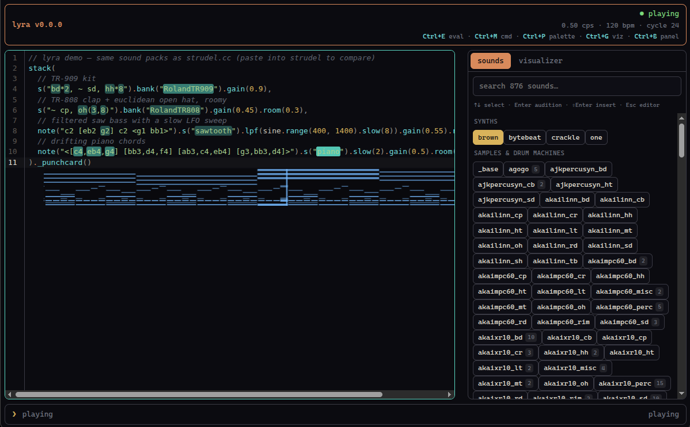

# 🎶 lyra

**A local-first, keyboard-driven live-coding music environment** — Strudel's
pattern language and full synth/sampler/FX engine ([superdough]), running as a
native desktop app on your machine. No browser tab, no server.

> Status: **early / MVP.** The desktop app (Electron) is at parity with the
> original terminal UI: write [Strudel] code, evaluate it live, and hear it
> through the browser-grade Web Audio engine. lyra is growing toward an
> audiovisual instrument (audio-reactive visuals, recording, AV export) — see
> [Roadmap](#roadmap). A legacy terminal UI also still ships.



## Why

[Strudel] is a wonderful, browser-based port of [TidalCycles]. lyra keeps
Strudel's exact language and instruments but packages the whole thing as a
local desktop instrument — keyboard-first, dark, distraction-free — so live
coding feels like a focused creative tool rather than a web page.

## How it works

lyra reuses Strudel's real pattern engine and synth engine. A small
platform-agnostic **core** (`src/core`) wires them together and is driven by an
*injected* audio context, so the same engine runs in two hosts:

```
your code
   │  @strudel/transpiler   (source → Pattern)
   ▼
@strudel/core + @strudel/mini    (TidalCycles-style pattern algebra)
   │  Cyclist scheduler (look-ahead clock)
   ▼
superdough              (Strudel's synth / sampler / FX engine)
   │
   ├─ desktop app  → the renderer's NATIVE Web Audio (Chromium)   ← primary
   └─ headless TUI → node-web-audio-api (Rust Web Audio for Node)
   ▼
your speakers
```

The desktop renderer is the host superdough was written for (a real browser
engine), so it needs none of the headless shims the terminal path requires —
and it unlocks GPU visuals, a real code editor, and AV export down the road.
See [`docs/ARCHITECTURE.md`](docs/ARCHITECTURE.md) for the full design and
migration plan.

Everything we author is **pure TypeScript** (strict, ESM); the upstream Strudel
packages are consumed through typed wrappers.

## Requirements

- Node ≥ 22 (developed on Node 24)
- Linux audio works with ALSA/PipeWire. (The headless TUI path uses a
  `playback` latency hint and supports `pw-jack`; the desktop app uses
  Chromium's own audio and needs no such tuning.)

## Getting started

```bash
npm install        # postinstall patches a mis-packaged transitive dep
npm run gui        # launch the desktop app
```

In the app:

- **Ctrl+E** (or **Ctrl+Enter**) — evaluate the buffer and hot-swap the pattern
- **Ctrl+S** — save · **Ctrl+M** — focus the command line · **Ctrl+P** — focus the palette
- **Ctrl+G** — cycle the visualizer · **Ctrl+B** — toggle the palette · **Ctrl+Q** — quit · **Tab** indents
- Type a pattern, hit **Ctrl+E**, and it plays. Edit and re-evaluate to morph it live.

The three focus regions are the **editor**, the **command line** (bottom), and the
**palette** (right). Esc returns to the editor from either.

### Commands (command bar — Ctrl+M or click)

```
/play  /stop  /bpm <n>  /cps <n>  /open <file>  /save  /theme <name>
/viz <name|off>  /settings  /rec <name>  /help
```

A leading `/` is optional. `/theme` and `/viz` with no name list the options.

## Visuals

Strudel-style, frame-locked to the audio clock:

- **In-editor highlighting** — the notes light up in your code as they sound
  (the events' source locations flash live).
- **Pianoroll / punchcard** — the right-hand pane scrolls the pattern's notes
  around a playhead (Strudel's own `@strudel/draw`).
- **scope / spectrum** — extra analyser visualizers.
- **Inline visuals** — attach a draw method to a pattern and it renders as a
  block **right after that line**, with code flowing below: `._pianoroll()`,
  `._punchcard()`, `._spiral()`, `._scope()`, `._wordfall()`, `._pitchwheel()`,
  e.g. `s("bd sd, hh*8")._punchcard()`. Set the block height with
  `"inlineVizHeight"` (px) in settings.json.

## Palette (sounds + visuals)

The palette is the right-hand, tabbed pane — **resizable** (drag the splitter)
and collapsible (**Ctrl+B**). Focus it with **Ctrl+P**.

- **Sounds** — browse the registered sounds (synths + loaded sample packs / drum
  machines). With the palette focused: type to **search**, **↑/↓** to select,
  **Enter** to **audition** the selected sound, **Shift+Enter** to insert a
  snippet at the cursor (**Esc** returns to the editor). Click a sound to
  audition it; double-click to insert.
- **Visualizer** — the pianoroll / punchcard / scope / spectrum pane. Cycle with
  **Ctrl+G**, the `/viz <name>` command, or by clicking the label.

## Sound library

On launch lyra loads the same default sounds as strudel.cc (drum machines, the
classic Dirt samples, piano, EmuSP12, VCSL, mridangam) from
[felixroos/dough-samples], so `s("bd sd hh")`, `.bank("RolandTR909")`, and the
synths all work out of the box. Loading is best-effort and online for now
(offline = built-in synths only); local caching is on the roadmap. Add your own
folders via `samples` in settings.

## Themes

Three dark themes ship in [`src/shared/themes.ts`](src/shared/themes.ts):
**lyra** (warm), **midnight** (cool), **forest** (green). Each styles the UI
chrome *and* the editor's syntax highlighting. Select one:

- live in the app: `/theme midnight`
- or in settings: `"theme": "midnight"`

## Configuration

Settings live in `~/.config/lyra/settings.json` (run `/settings` to open them).
They deep-merge over the defaults — set only what you want to change:

```jsonc
{
  "theme": "lyra",                       // lyra · midnight · forest
  "tempo": { "cps": 0.5 },
  "samples": ["~/samples/my-drum-machine"],  // folders / strudel.json to auto-load
  "audio": { "worklets": true }
}
```

Sample folders listed in `samples` (plus your recordings dir) are scanned and
registered on startup, so `s("<name>")` plays them.

## Legacy terminal UI

The original terminal UI still works and shares the same engine:

```bash
npm run dev        # launch the TUI (Ink); Ctrl+E eval, Tab command bar, Ctrl+Q quit
lyra [file]        # the `lyra` launcher currently opens the TUI (see Known issues)
```

### Crackly audio in the TUI?

That's buffer underruns on the headless path. On PipeWire, lyra pins its buffer
via `audio.pipewireLatency` (default `1024/48000` ≈ 21 ms); raise it to
`2048/48000` for more headroom. (The desktop app doesn't use this.)

## Known issues

- The `lyra` PATH launcher (and `lyra [file]`) still opens the **terminal** UI;
  the desktop app is launched with `npm run gui [file]`. Unifying the launcher
  (a `lyra` that opens the desktop app, `lyra --tui` for the terminal) is a
  follow-up.
- Recording (`/rec`) is implemented in the TUI but not yet in the desktop app
  (planned for the recording/export phase).

## Roadmap

- [x] Headless audio: superdough on node-web-audio-api (TUI)
- [x] Strudel pattern engine + Cyclist scheduler wired to audio
- [x] Reusable platform-agnostic core (`src/core`) + node/browser bindings
- [x] Desktop app (Electron): CodeMirror editor, transport, commands, file I/O, themes
- [x] Visuals: live in-editor highlighting + pianoroll / punchcard (Strudel-style)
- [x] Default sound library (Strudel's packs) + a searchable sounds browser
- [x] Tabbed, resizable right panel (sounds + visuals)
- [ ] WebGL shader / Hydra-style audio-reactive visuals
- [ ] Local-first sample caching (bundle/cache packs for offline)
- [ ] Project explorer
- [ ] Recording (desktop) + audio/video export
- [ ] Unified `lyra` launcher + packaged builds (Win/Mac/Linux)

## Development

```bash
npm run gui            # desktop app (Vite + Electron)
npm run dev            # terminal UI
npm run typecheck      # strict TypeScript, no emit
npm run build:renderer # production renderer bundle
```

Smoke tests for the headless engine live in `src/spike/*` (`npm run spike:*`),
and the original Electron proof-of-concept is in `spike/electron/`.

## Credits

Built on the work of the [Strudel] and [TidalCycles] communities. lyra is a
local desktop shell around their engines.

[Strudel]: https://strudel.cc
[superdough]: https://www.npmjs.com/package/superdough
[TidalCycles]: https://tidalcycles.org
[node-web-audio-api]: https://github.com/ircam-ismm/node-web-audio-api
[felixroos/dough-samples]: https://github.com/felixroos/dough-samples
